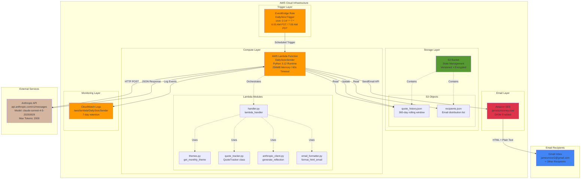
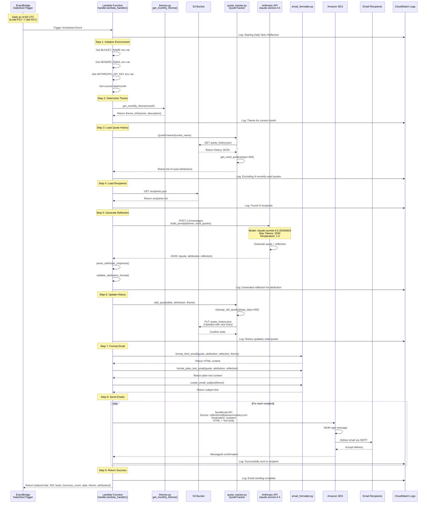
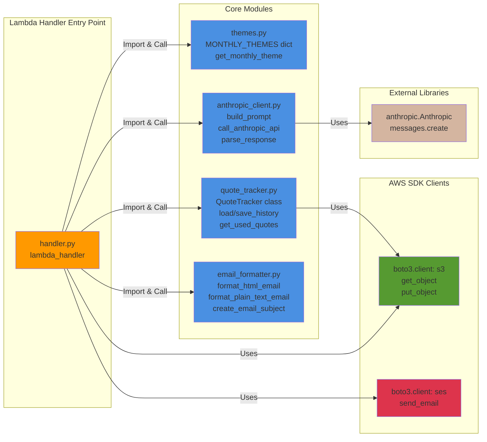

# Daily Stoic Reflection - System Architecture & Data Flow

This document provides a comprehensive view of the system architecture, data flow, and all services/endpoints involved in the Daily Stoic Reflection service.

## System Architecture Diagram



## Detailed Data Flow Sequence



## Service Endpoints & Configuration

### AWS Services

| Service | Endpoint/Resource | Configuration |
|---------|------------------|---------------|
| **EventBridge** | `events.us-west-2.amazonaws.com` | Rule: `DailyStoicTrigger`<br/>Schedule: `cron(0 14 * * ? *)` |
| **Lambda** | `lambda.us-west-2.amazonaws.com` | Function: `DailyStoicSender`<br/>Runtime: `python3.12`<br/>Handler: `handler.lambda_handler` |
| **S3** | `s3.us-west-2.amazonaws.com` | Bucket: Auto-generated name<br/>Objects: `quote_history.json`, `recipients.json` |
| **SES** | `email.us-west-2.amazonaws.com` | Domain: `jamescmooney.com`<br/>Sender: `reflections@jamescmooney.com`<br/>API: `SendEmail` |
| **CloudWatch Logs** | `logs.us-west-2.amazonaws.com` | Log Group: `/aws/lambda/DailyStoicSender`<br/>Retention: 7 days |

### External API Endpoints

| Service | Endpoint | Method | Request Details |
|---------|----------|--------|-----------------|
| **Anthropic Messages API** | `https://api.anthropic.com/v1/messages` | POST | **Model**: `claude-sonnet-4-5-20250929`<br/>**Max Tokens**: 2000<br/>**Temperature**: 1.0<br/>**Timeout**: 25 seconds<br/>**Headers**: `x-api-key`, `anthropic-version: 2023-06-01` |

### S3 Data Objects

#### quote_history.json
```json
{
  "quotes": [
    {
      "date": "2025-10-21",
      "attribution": "Marcus Aurelius - Meditations 4.3",
      "theme": "Mortality and Impermanence"
    }
  ]
}
```
**Operations**:
- `s3:GetObject` - Read by QuoteTracker.load_history()
- `s3:PutObject` - Write by QuoteTracker.save_history()

#### recipients.json
```json
{
  "recipients": [
    "jamesmoon2@gmail.com"
  ]
}
```
**Operations**:
- `s3:GetObject` - Read by load_recipients_from_s3()

## Lambda Function Module Architecture



## Data Flow by Step

### Step 1: Initialization (handler.py:50-73)
```
Environment Variables:
  - BUCKET_NAME → S3 bucket for state
  - SENDER_EMAIL → reflections@jamescmooney.com
  - ANTHROPIC_API_KEY → sk-ant-...
  - AWS_REGION → us-west-2

Current State:
  - current_date = datetime.now()
  - current_month = date.month (1-12)
  - theme_info = get_monthly_theme(current_month)
```

### Step 2: Load Quote History (handler.py:75-81)
```
S3 Read Operation:
  Bucket: {BUCKET_NAME}
  Key: quote_history.json

Processing:
  - QuoteTracker.load_history()
  - QuoteTracker.get_used_quotes(days=365)
  - Filters quotes from last 365 days
  - Returns list of attribution strings
```

### Step 3: Load Recipients (handler.py:83-88)
```
S3 Read Operation:
  Bucket: {BUCKET_NAME}
  Key: recipients.json

Returns:
  Array of email addresses
```

### Step 4: Generate Reflection (handler.py:90-106)
```
API Call:
  Endpoint: https://api.anthropic.com/v1/messages
  Method: POST

Request Body:
  {
    "model": "claude-sonnet-4-5-20250929",
    "max_tokens": 2000,
    "temperature": 1.0,
    "messages": [
      {
        "role": "user",
        "content": "{prompt with theme and exclusion list}"
      }
    ]
  }

Response:
  {
    "quote": "Stoic quote text",
    "attribution": "Author - Work Section",
    "reflection": "250-450 word reflection"
  }
```

### Step 5: Update History (handler.py:112-120)
```
S3 Write Operation:
  Bucket: {BUCKET_NAME}
  Key: quote_history.json

Data:
  - Append new entry: {date, attribution, theme}
  - Cleanup quotes older than 400 days
  - Write updated JSON back to S3
```

### Step 6: Send Emails (handler.py:122-147)
```
SES API Call (per recipient):
  Operation: SendEmail

Parameters:
  - Source: reflections@jamescmooney.com
  - Destination.ToAddresses: [recipient]
  - Message.Subject: "Daily Stoic Reflection: {theme}"
  - Message.Body.Html: {formatted HTML}
  - Message.Body.Text: {plain text fallback}

Response:
  - MessageId: AWS message identifier
```

## IAM Permissions Required

```json
{
  "Lambda Execution Role": {
    "S3 Permissions": [
      "s3:GetObject",
      "s3:PutObject"
    ],
    "Resources": [
      "arn:aws:s3:::{bucket-name}/*"
    ],
    "SES Permissions": [
      "ses:SendEmail",
      "ses:SendRawEmail"
    ],
    "Resources": ["*"],
    "CloudWatch Logs": [
      "logs:CreateLogGroup",
      "logs:CreateLogStream",
      "logs:PutLogEvents"
    ]
  }
}
```

## Cost Breakdown by Endpoint

| Service/Endpoint | Monthly Usage | Unit Cost | Monthly Cost |
|-----------------|---------------|-----------|--------------|
| EventBridge Rule Invocations | 30 triggers | Free tier | $0.00 |
| Lambda Invocations | 30 executions × 10s | Free tier | $0.00 |
| S3 GET Requests | 60 requests | $0.0004/1K | $0.00 |
| S3 PUT Requests | 30 requests | $0.005/1K | $0.00 |
| S3 Storage | ~1 MB | $0.023/GB | $0.00 |
| SES SendEmail API | 30 emails | $0.10/1K | $0.003 |
| Anthropic Messages API | 30 calls × 2K tokens | $3.00/1M tokens | $0.18 |
| CloudWatch Logs | ~50 MB | Free tier (5GB) | $0.00 |
| **Total** | | | **~$0.18/month** |

## Performance Metrics

| Metric | Typical Value | Maximum |
|--------|---------------|---------|
| **Lambda Execution Time** | 8-12 seconds | 60 seconds (timeout) |
| **Anthropic API Response Time** | 3-8 seconds | 25 seconds (timeout) |
| **S3 Read Latency** | 50-100 ms | - |
| **S3 Write Latency** | 100-200 ms | - |
| **SES Delivery Time** | 30-120 seconds | - |
| **End-to-End Time** | 10-15 seconds | - |
| **Lambda Memory Usage** | 100-150 MB | 256 MB (allocated) |

## Error Handling & Retry Logic


## Monthly Themes Configuration

The system uses a predefined theme for each month (themes.py:17-66):

| Month | Theme | Description |
|-------|-------|-------------|
| January | Discipline and Self-Improvement | Building habits, self-control, starting fresh |
| February | Relationships and Community | Connections to others, love, friendship |
| March | Resilience and Adversity | Facing challenges, mental toughness |
| April | Nature and Acceptance | Living in accordance with nature |
| May | Virtue and Character | Four cardinal virtues |
| June | Wisdom and Philosophy | Continuous learning, philosophical practice |
| July | Freedom and Autonomy | Inner freedom, independence of mind |
| August | Patience and Endurance | Long-term thinking, persistence |
| September | Purpose and Calling | Finding meaning, living deliberately |
| October | Mortality and Impermanence | Memento mori, perspective on death |
| November | Gratitude and Contentment | Appreciating what we have |
| December | Reflection and Legacy | Year-end contemplation, what we leave behind |

## Security Architecture


## Monitoring & Logging Points

### CloudWatch Log Events (handler.py)

| Log Point | Line | Message | Level |
|-----------|------|---------|-------|
| Start | 47 | "Starting Daily Stoic Reflection generation" | INFO |
| Environment | 60-61 | "Using bucket: {bucket_name}" | INFO |
| Theme | 71-73 | "Date/Month/Theme info" | INFO |
| History Loaded | 81 | "Excluding {n} recently used quotes" | INFO |
| Recipients | 85 | "Found {n} recipients" | INFO |
| API Call | 91 | "Generating reflection via Anthropic API..." | INFO |
| Generated | 105 | "Generated reflection for: {attribution}" | INFO |
| History Update | 113-120 | "Updating quote history..." | INFO |
| Email Start | 127 | "Sending emails..." | INFO |
| Email Success | 142 | "Successfully sent email to {recipient}" | INFO |
| Email Failure | 146 | "Failed to send email to {recipient}: {error}" | ERROR |
| Complete | 150-152 | "Email sending complete. Success/Failed counts" | INFO |
| Fatal Error | 167 | "Fatal error in lambda_handler: {error}" | ERROR |

---

**Document Version**: 1.0
**Last Updated**: 2025-10-25
**Generated**: Based on complete codebase analysis
